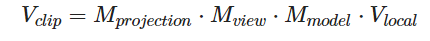

# 坐标系统

将坐标变换为标准化设备坐标，接着再转化为屏幕坐标的过程通常是分步进行的，也就是类似于流水线那样子。在流水线中，物体的顶点在最终转化为屏幕坐标之前还会被变换到多个坐标系统(Coordinate System)。将物体的坐标变换到几个过渡坐标系(Intermediate Coordinate System)的优点在于，在这些特定的坐标系统中，一些操作或运算更加方便和容易，这一点很快就会变得很明显。对我们来说比较重要的总共有 5 个不同的坐标系统：

-   局部空间(Local Space，或者称为物体空间(Object Space))
-   世界空间(World Space)
-   观察空间(View Space，或者称为视觉空间(Eye Space))
-   裁剪空间(Clip Space)
-   屏幕空间(Screen Space)

1. 局部坐标是对象相对于局部原点的坐标，也是物体起始的坐标。
2. 下一步是将局部坐标变换为世界空间坐标，世界空间坐标是处于一个更大的空间范围的。这些坐标相对于世界的全局原点，它们会和其它物体一起相对于世界的原点进行摆放。
3. 接下来我们将世界坐标变换为观察空间坐标，使得每个坐标都是从摄像机或者说观察者的角度进行观察的。
4. 坐标到达观察空间之后，我们需要将其投影到裁剪坐标。裁剪坐标会被处理至-1.0到1.0的范围内，并判断哪些顶点将会出现在屏幕上。
5. 最后，我们将裁剪坐标变换为屏幕坐标，我们将使用一个叫做视口变换(Viewport Transform)的过程。视口变换将位于-1.0到1.0范围的坐标变换到由glViewport函数所定义的坐标范围内。最后变换出来的坐标将会送到光栅器，将其转化为片段。

## 局部空间

局部空间是指物体所在的坐标空间，即对象最开始所在的地方。想象你在一个建模软件（比如说Blender）中创建了一个立方体。你创建的立方体的原点有可能位于(0, 0, 0)，即便它有可能最后在程序中处于完全不同的位置。甚至有可能你创建的所有模型都以(0, 0, 0)为初始位置（译注：然而它们会最终出现在世界的不同位置）。所以，你的模型的所有顶点都是在局部空间中：它们相对于你的物体来说都是局部的。

我们一直使用的那个箱子的顶点是被设定在-0.5到0.5的坐标范围中，(0, 0)是它的原点。这些都是局部坐标。

## 世界空间

如果你希望将物体分散在世界上摆放（特别是非常真实的那样），这就是你希望物体变换到的空间。物体的坐标将会从局部变换到世界空间；该变换是由模型矩阵(Model Matrix)实现的。

## 观察空间

观察空间经常被人们称之OpenGL的摄像机(Camera)（所以有时也称为摄像机空间(Camera Space)或视觉空间(Eye Space)）。观察空间是将世界空间坐标转化为用户视野前方的坐标而产生的结果。因此观察空间就是从摄像机的视角所观察到的空间。而这通常是由一系列的位移和旋转的组合来完成，平移/旋转场景从而使得特定的对象被变换到摄像机的前方。这些组合在一起的变换通常存储在一个观察矩阵(View Matrix)里，它被用来将世界坐标变换到观察空间。

**他会把所有在世界坐标的物体都转换，再接下来才被进行裁剪**

## 裁剪空间

在一个顶点着色器运行的最后，OpenGL期望所有的坐标都能落在一个特定的范围内，且任何在这个范围之外的点都应该被裁剪掉(Clipped)。被裁剪掉的坐标就会被忽略，所以剩下的坐标就将变为屏幕上可见的片段。这也就是裁剪空间(Clip Space)名字的由来。

因为将所有可见的坐标都指定在-1.0到1.0的范围内不是很直观，所以我们会指定自己的坐标集(Coordinate Set)并将它变换回标准化设备坐标系，就像OpenGL期望的那样。

为了将顶点坐标从观察变换到裁剪空间，我们需要定义一个投影矩阵(Projection Matrix)，它指定了一个范围的坐标，比如在每个维度上的-1000到1000。投影矩阵接着会将在这个指定的范围内的坐标变换为标准化设备坐标的范围(-1.0, 1.0)。所有在范围外的坐标不会被映射到在-1.0到1.0的范围之间，所以会被裁剪掉。在上面这个投影矩阵所指定的范围内，坐标(1250, 500, 750)将是不可见的，这是由于它的x坐标超出了范围，它被转化为一个大于1.0的标准化设备坐标，所以被裁剪掉了。

>如果只是图元(Primitive)，例如三角形，的一部分超出了裁剪体积(Clipping Volume)，则OpenGL会重新构建这个三角形为一个或多个三角形让其能够适合这个裁剪范围。

在裁剪空间中，将会根据投影矩阵创建的观察箱(Viewing Box)被称为平截头体(Frustum)，每个出现在平截头体范围内的坐标都会最终出现在用户的屏幕上。将特定范围内的坐标转化到标准化设备坐标系的过程（而且它很容易被映射到2D观察空间坐标）被称之为投影(Projection)，因为使用投影矩阵能将3D坐标投影(Project)到很容易映射到2D的标准化设备坐标系中。

裁剪空间将会进行以正射投影矩阵(Orthographic Projection Matrix)或一个透视投影矩阵(Perspective Projection Matrix)进行裁剪

## 正射投影

获取到的坐标将会是x,y,z,w，w在这里将会是1.0来让每个坐标对观察者的距离相等
正射的参数需要后去上下左右和近远

## 透视投影

透视有远近，有近大远小，每个获取到的坐标x,y,z将会通过除以w以造成近大远小的效果，w可以认为就是距离，实际的取值将会从提供的平截头体范围映射获取，所以可以简单的认为就是距离

## 组合

注意矩阵运算的顺序是相反的（记住我们需要从右往左阅读矩阵的乘法）。最后的顶点应该被赋值到顶点着色器中的gl_Position，OpenGL将会自动进行透视除法和裁剪。然后透视除法到标准化设备坐标，再转换到屏幕坐标上

# 右手坐标系

opengl 是一个右手坐标系

为了理解为什么被称为右手坐标系，按如下的步骤做：

* 沿着正y轴方向伸出你的右臂，手指着上方。
* 大拇指指向右方。
* 食指指向上方。
* 中指向下弯曲90度。

如果你的动作正确，那么你的大拇指指向正x轴方向，食指指向正y轴方向，中指指向正z轴方向。如果你用左臂来做这些动作，你会发现z轴的方向是相反的。这个叫做左手坐标系，它被DirectX广泛地使用。注意在标准化设备坐标系中OpenGL实际上使用的是左手坐标系（投影矩阵交换了左右手）
