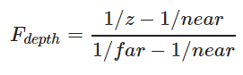

# 深度测试

---

深度缓冲就像颜色缓冲(Color Buffer)（储存所有的片段颜色：视觉输出）一样，在每个片段中储存了信息，并且（通常）和颜色缓冲有着一样的宽度和高度。深度缓冲是由窗口系统自动创建的，它会以16、24或32位float的形式储存它的深度值。在大部分的系统中，深度缓冲的精度都是24位的。

gl_FragCoord的x和y分量代表了片段的屏幕空间坐标（其中(0, 0)位于左下角）。gl_FragCoord中也包含了一个z分量，它包含了片段真正的深度值。z值就是需要与深度缓冲内容所对比的那个值。

>现在大部分的GPU都提供一个叫做提前深度测试(Early Depth Testing)的硬件特性。提前深度测试允许深度测试在片段着色器之前运行。只要我们清楚一个片段永远不会是可见的（它在其他物体之后），我们就能提前丢弃这个片段。

>片段着色器通常开销都是很大的，所以我们应该尽可能避免运行它们。当使用提前深度测试时，片段着色器的一个限制是你不能写入片段的深度值。如果一个片段着色器对它的深度值进行了写入，提前深度测试是不可能的。OpenGL不能提前知道深度值。

# 深度值精度

---

深度缓冲包含了一个介于0.0和1.0之间的深度值，它将会与观察者视角所看见的场景中所有物体的z值进行比较。观察空间的z值可能是投影平截头体的近平面(Near)和远平面(Far)之间的任何值。我们需要一种方式来将这些观察空间的z值变换到[0, 1]范围之间，其中的一种方式就是将它们线性变换到[0, 1]范围之间。

然而，在实践中是几乎永远不会使用这样的线性深度缓冲(Linear Depth Buffer)的。要想有正确的投影性质，需要使用一个非线性的深度方程，它是与 1/z 成正比的。它做的就是在z值很小的时候提供非常高的精度，而在z值很远的时候提供更少的精度。花时间想想这个：我们真的需要对1000单位远的深度值和只有1单位远的充满细节的物体使用相同的精度吗？线性方程并不会考虑这一点。

# 深度冲突

一个很常见的视觉错误会在两个平面或者三角形非常紧密地平行排列在一起时会发生，深度缓冲没有足够的精度来决定两个形状哪个在前面。结果就是这两个形状不断地在切换前后顺序，这会导致很奇怪的花纹。这个现象叫做深度冲突(Z-fighting)，因为它看起来像是这两个形状在争夺(Fight)谁该处于顶端。

# 防止深度冲突

第一个也是最重要的技巧是永远不要把多个物体摆得太靠近，以至于它们的一些三角形会重叠。通过在两个物体之间设置一个用户无法注意到的偏移值，你可以完全避免这两个物体之间的深度冲突。在箱子和地板的例子中，我们可以将箱子沿着正y轴稍微移动一点。箱子位置的这点微小改变将不太可能被注意到，但它能够完全减少深度冲突的发生。然而，这需要对每个物体都手动调整，并且需要进行彻底的测试来保证场景中没有物体会产生深度冲突。

第二个技巧是尽可能将近平面设置远一些。在前面我们提到了精度在靠近近平面时是非常高的，所以如果我们将近平面远离观察者，我们将会对整个平截头体有着更大的精度。然而，将近平面设置太远将会导致近处的物体被裁剪掉，所以这通常需要实验和微调来决定最适合你的场景的近平面距离。

另外一个很好的技巧是牺牲一些性能，使用更高精度的深度缓冲。大部分深度缓冲的精度都是24位的，但现在大部分的显卡都支持32位的深度缓冲，这将会极大地提高精度。所以，牺牲掉一些性能，你就能获得更高精度的深度测试，减少深度冲突。

我们上面讨论的三个技术是最普遍也是很容易实现的抗深度冲突技术了。还有一些更复杂的技术，但它们依然不能完全消除深度冲突。深度冲突是一个常见的问题，但如果你组合使用了上面列举出来的技术，你可能不会再需要处理深度冲突了。